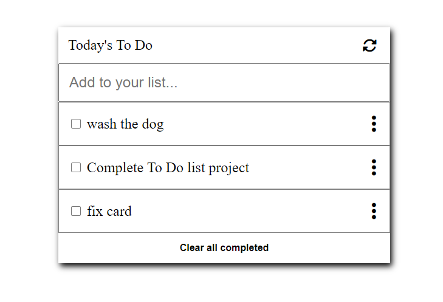

# A Simple Todo List

A Simple Todo List is a web application that allows users to create, manage, and persist their tasks using the browser's local storage. It provides functionalities to add, select, delete, and edit tasks, making it convenient for users to keep track of their to-do items.

## Build with

   

## Features

- **Add Task:** Users can easily add new tasks to their to-do list by entering task details and clicking on the "Add" button.
- **Select Task:** Users can mark tasks as completed or selected to highlight their importance or progress.
- **Delete Task:** Tasks that are no longer needed can be deleted from the list with a single click.
- **Edit Task:** Users have the flexibility to edit task details, such as the task name or due date, by clicking on the edit icon associated with each task.
- **Local Storage Persistence:** The application utilizes the browser's local storage to save and retrieve task data, ensuring that the tasks persist even after refreshing or closing the browser.

## Contact

If you would like to get in touch with me, you can do so through the following means:
- Email: reinaldojcg1@gmail.com
- GitHub: sazukeR

## 📝 License

- This project is [MIT](./MIT.md) licensed.

Thank you for visiting my profile, feel free to reach out if you have any questions or if you are looking to collaborate on a project.